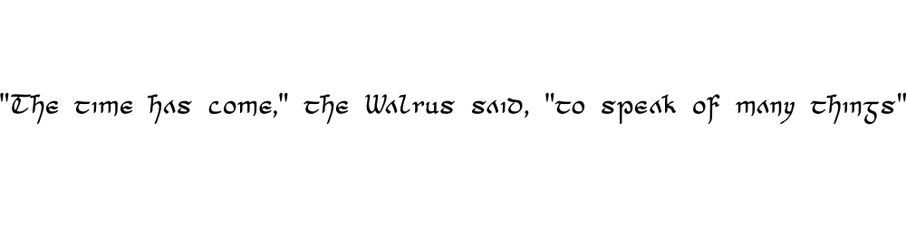

# A Collection of Third Party Fonts

Packaged for easy inclusion in my Go applications.

## Font Licences

| Font | License | Example |
| --- | --- | --- |
| [AlexBrush](https://fontlibrary.org/en/font/alex-brush) | [SIL OFL](https://openfontlicense.org/) |  |
| [Cianan](https://www.feorag.com/freestuff/cianan.html) | [CC BY-NC-SA 3](http://creativecommons.org/licenses/by-nc-sa/3.0/) |  |
| [XKCD](https://github.com/ipython/xkcd-font/) | [CC BY-NC 3](https://github.com/ipython/xkcd-font/blob/master/LICENSE) |  |
